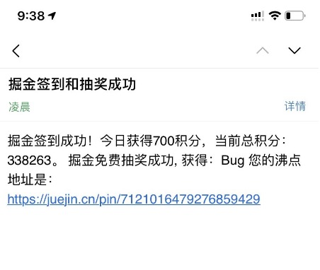
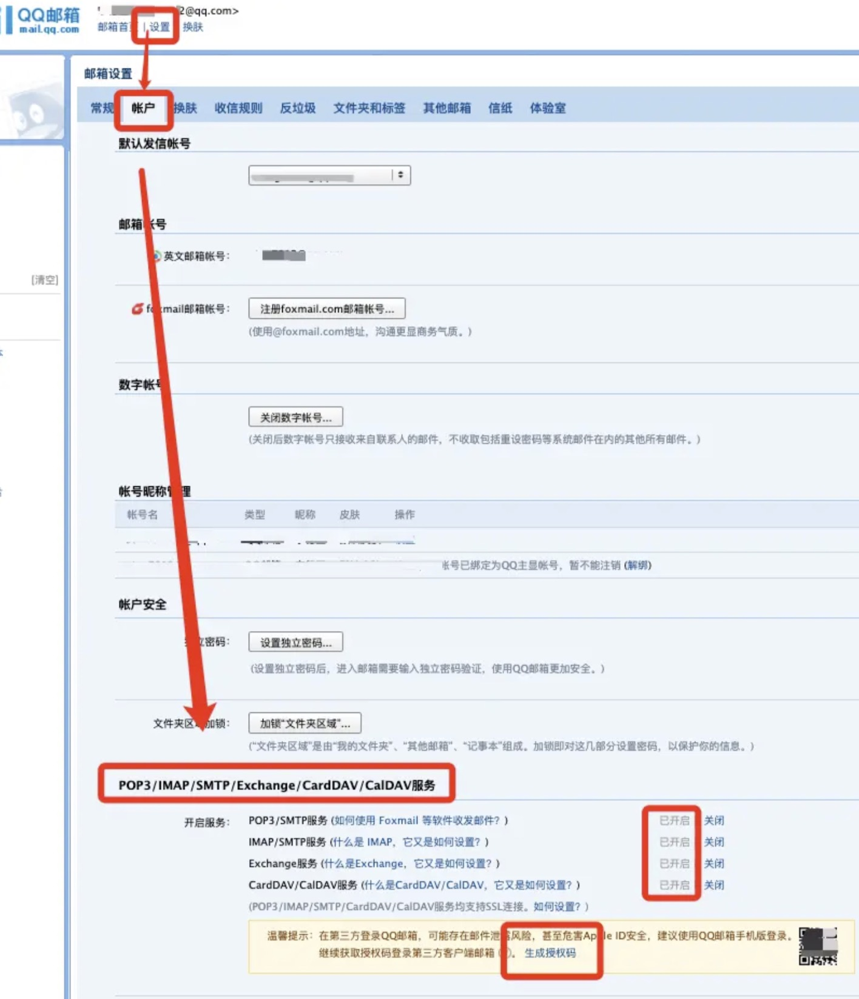

## 介绍
- 主要是用来掘金做沸点任务，可以自动定时每天发布沸点。
- 这个需要部署到你的服务器上，或者也可以部署到 阿里云、腾讯云的云函数中。
- 我这里是部署到了我自己的服务器中
- 邮箱接收效果：
- 数据库的话，可以使用爬虫去爬取一些数据进行填充，或者自己自定义填充。
- 如果对你有帮助，还请点一个Star 感谢大佬们


## 步骤
- 1.设计数据库、填充数据
- 2.使用node去调用接口
- 3.接口返回数据之后，在调用掘金的沸点接口
- 4.部署数据库和node，执行定时操作即可

## 运行
```bash

$ yarn install 或 npm install

# 顺序执行
$ src  nodemon ./getMysql.js 或 node ./getMysql.js
$ src  node index.js    
 
```

## 配置邮箱
- qq邮箱的pass获取
- 首先，登陆网页版QQ邮箱
- 其次，设置 -> 账户 -> POP3/IMAP/SMTP/Exchange/CardDAV/CalDAV服务 -> 开启服务 -> 生成授权码 -> 复制授权码。就能得到pass值了，如下图↓



## 注
- 如果对你有帮助，还请点一个star 感谢大佬们
- 建议看一下这个文章，配置云函数讲的很清楚
- 需要注意的话，如果云函数需要链接数据库的需要使用公网IP，不过可以使用云数据库。
- (腾讯云)云函数接入数据库:https://cloud.tencent.com/document/product/583/51935
- 参考文章地址:https://juejin.cn/post/7041495891388743716   
